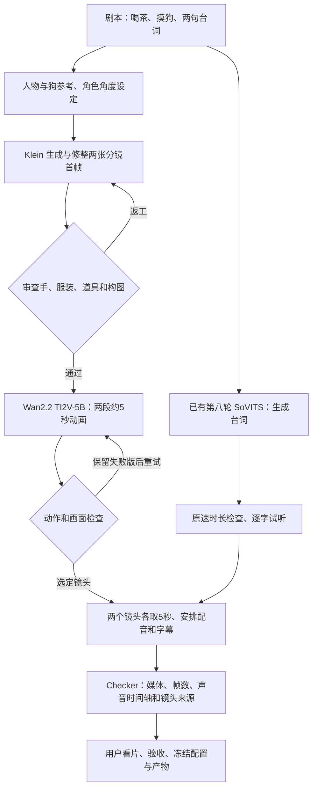
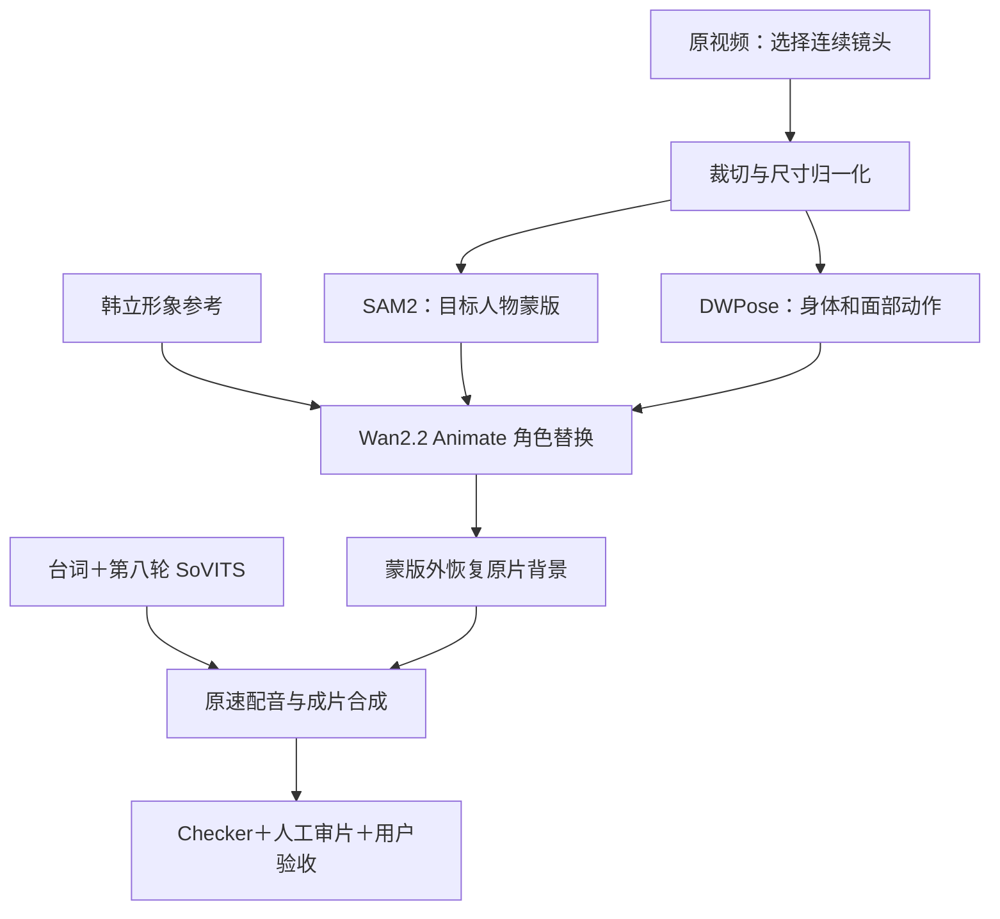

# 两种模式的 Workflow

## 直接生成：这次喝茶撸狗的流程

多面图用于角色设定与检查，Wan 接收的是镜头首帧。前期图像决定构图、道具和很大一部分画风；Wan 负责从首帧生成运动。声音是独立支线，当前不提供音素级口型。两条支线表示数据关系，不表示同时占用 GPU。

## 换皮：保留原片动作与背景

## 检查如何分工

- 自动 Checker：配置与模型哈希、输入和实际执行图、执行结果、视频时长/帧数/解码、音频时间轴和验收绑定。
- 看图看片与试听：像不像韩立、手是否自然、动作是否正确、声音有没有漏字、表现是否满意。
- 失败保留现场；已知任务 ID 只恢复等待/下载，提交状态不明时不自动重复提交。

执行细节见 [模式总览](VIDEO_MODES.md) 和两份接手规范。旧的四阶段 FaceFusion 规划已经退出当前执行路线。
